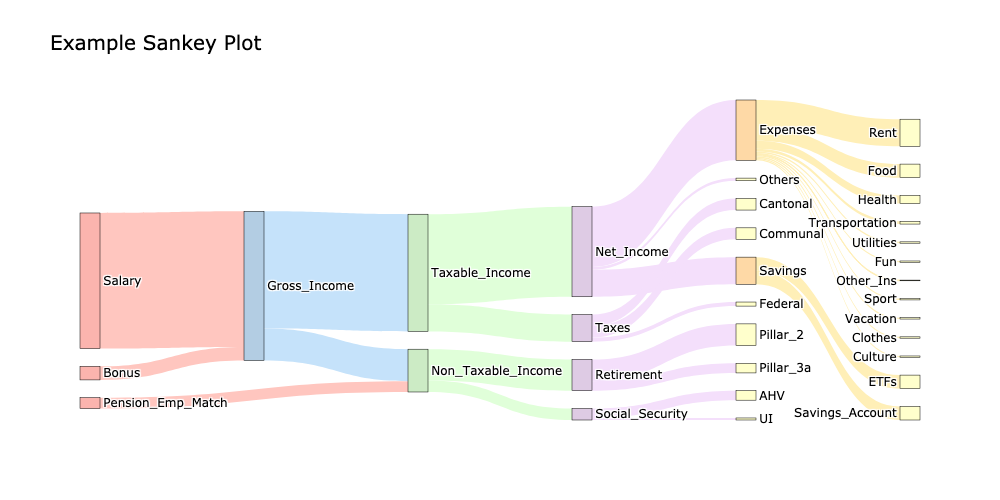

# Finance

Welcome to the Finance repository! This project is designed to help visualize financial data.

## Table of Contents

- [Introduction](#introduction)
- [Features](#features)
- [Installation](#installation)
- [Usage](#usage)
- [License](#license)

## Introduction

This project aims to provide tools and scripts for financial data management and analysis. It includes various functionalities to help users handle their financial information efficiently.

## Features

- Vizualize budget with a Sankey diagram
- [More features to come]

## Installation

To get started with this project, clone the repository and install the necessary dependencies:

```bash
git clone git@github.com:Arturjssln/Finance.git
cd Finance
# Install dependencies
pip install -r requirements.txt
```

## Usage
### Sankey Diagram
Run the following:
```bash
# Example command to run a script
python gen_plot.py --input data/input.yaml --config data/config.yaml
```

Example generated image:



## License

This project is licensed under the MIT License. See the [LICENSE](LICENSE) file for more details.